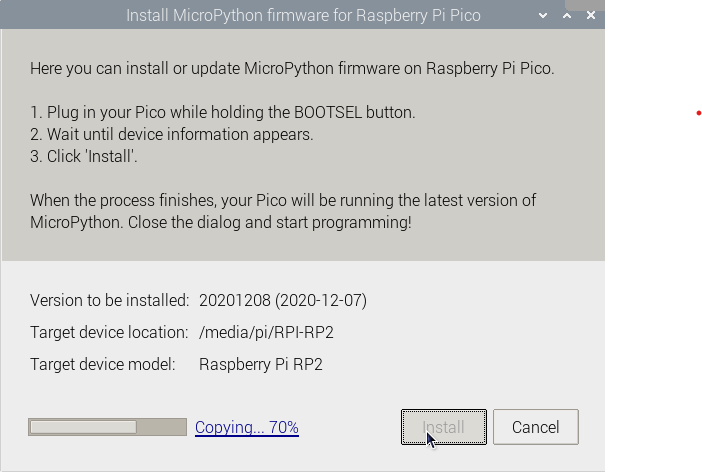

Firmware installation menu

You can also access the firmware installation menu if you click on 'MicroPython (Raspberry Pi Pico)' in the status bar and choose 'Configure interpreter ...'.

The interpreter settings will open.

Click on **Install or update firmware**. 

You will be prompted to plug in your Raspberry Pi Pico while you hold the BOOTSEL button. 

Then you can click **Install**. 

Wait for the installation to complete and click **Close**.
